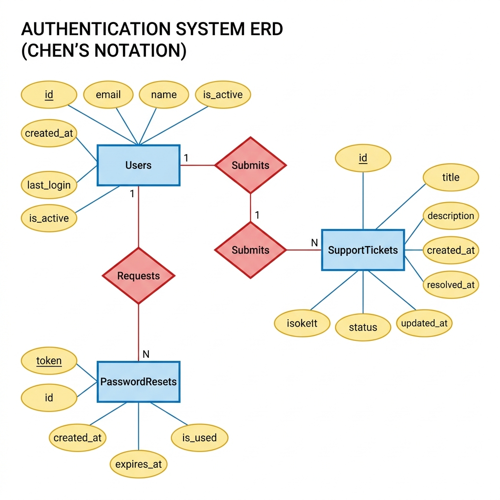
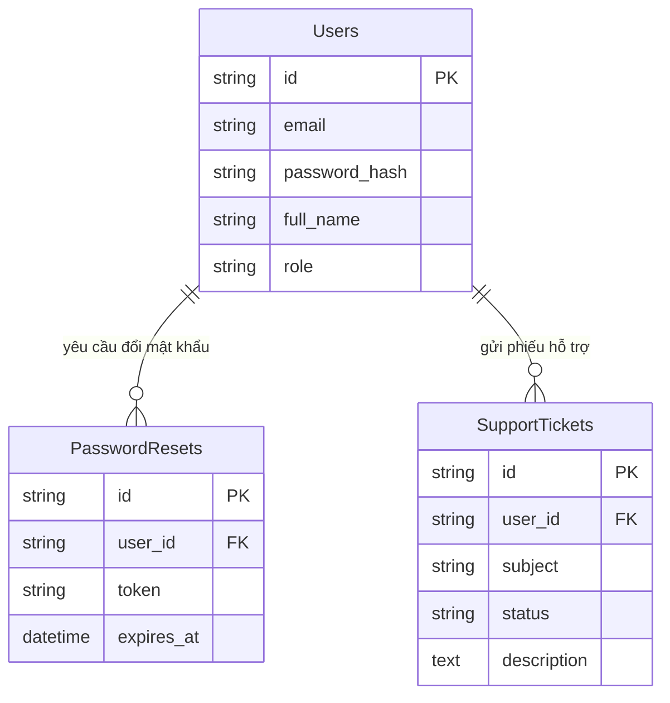
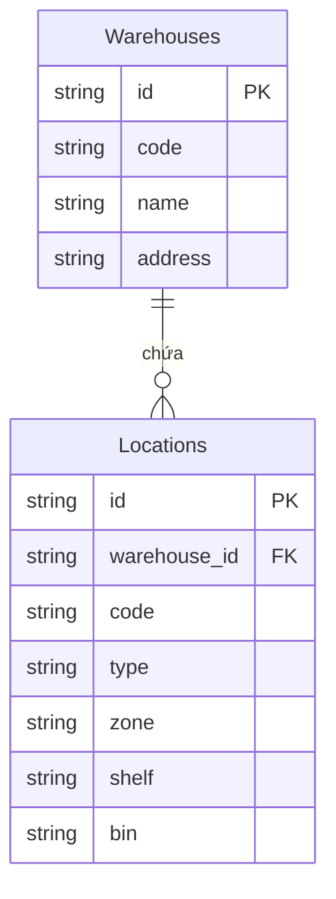
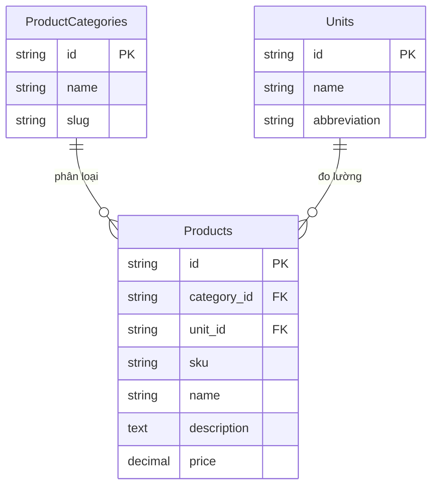
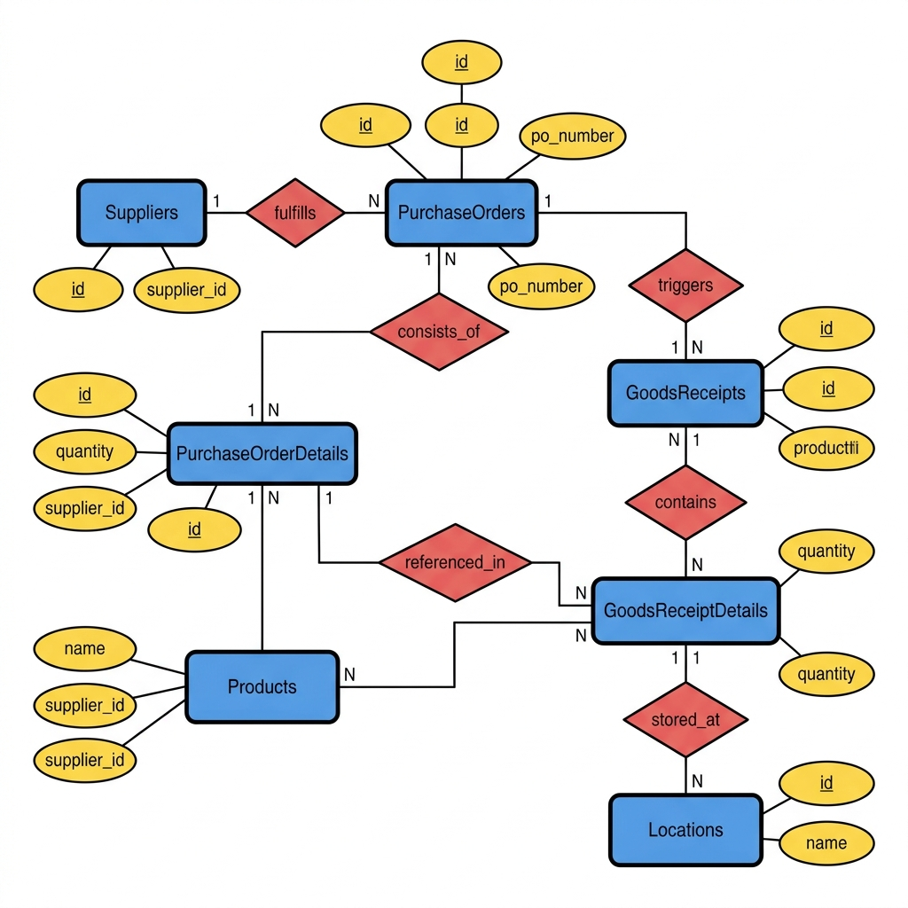
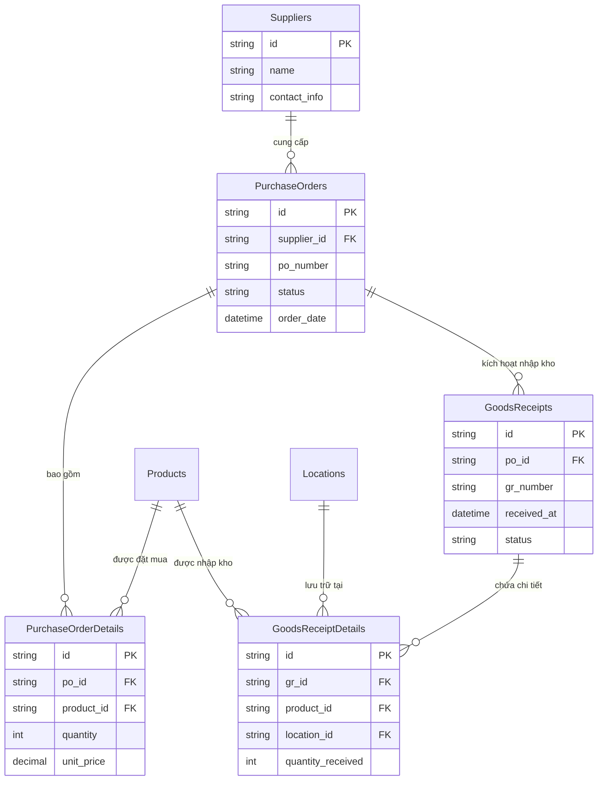
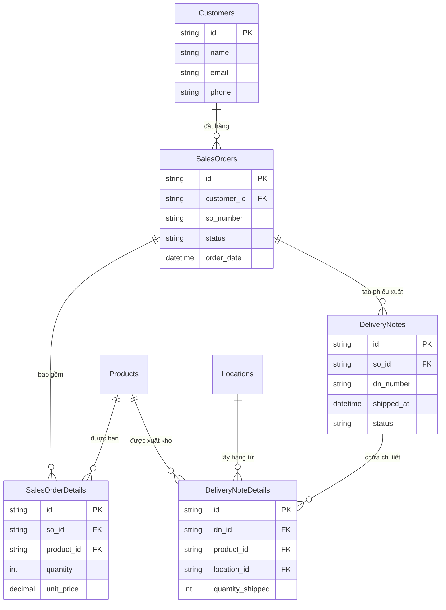
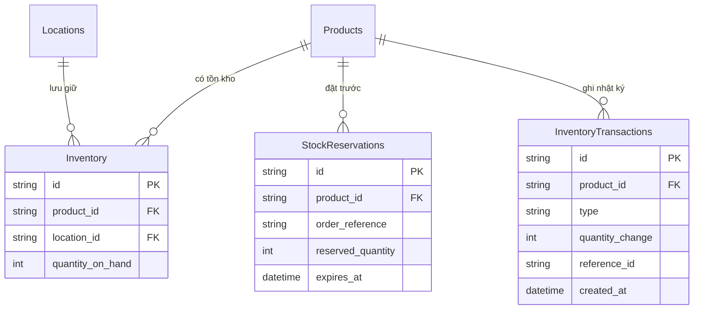

# Sơ Đồ ERD Theo Từng Luồng Nghiệp Vụ - Hệ Thống WMS

Tài liệu này chia nhỏ sơ đồ ERD tổng thể của hệ thống WMS thành **6 luồng nghiệp vụ** riêng biệt, giúp dễ đọc và dễ hiểu hơn.

> **Ghi chú:** Mỗi luồng bao gồm sơ đồ ERD dạng Mermaid (render tự động) và hình ảnh minh họa dạng Chen (nếu có).

---

## 1. Luồng Đăng Nhập & Bảo Mật (Auth & Security)

**Mô tả:** Quản lý người dùng, đặt lại mật khẩu và phiếu hỗ trợ kỹ thuật.

**Các bảng liên quan:** `Users`, `PasswordResets`, `SupportTickets`

**Quan hệ:**
- Một `User` có thể yêu cầu nhiều lần `PasswordReset` (1:N)
- Một `User` có thể gửi nhiều `SupportTicket` (1:N)

### Sơ đồ ERD dạng Chen

### Sơ đồ ERD dạng Mermaid

---

## 2. Luồng Hạ Tầng Kho (Infrastructure)

**Mô tả:** Định nghĩa cấu trúc vật lý của kho hàng, từ tòa nhà đến vị trí lưu trữ cụ thể.

**Các bảng liên quan:** `Warehouses`, `Locations`

**Quan hệ:**
- Một `Warehouse` chứa nhiều `Location` (1:N)

### Sơ đồ ERD dạng Mermaid

---

## 3. Luồng Sản Phẩm & Dữ Liệu Gốc (Product & Core Data)

**Mô tả:** Danh mục sản phẩm, phân loại danh mục và đơn vị đo lường.

**Các bảng liên quan:** `Products`, `ProductCategories`, `Units`

**Quan hệ:**
- Một `ProductCategory` phân loại nhiều `Product` (1:N)
- Một `Unit` đo lường nhiều `Product` (1:N)

### Sơ đồ ERD dạng Mermaid

---

## 4. Luồng Nhập Hàng (Inbound Flow)

**Mô tả:** Vòng đời mua hàng: Nhà cung cấp → Đơn mua hàng → Phiếu nhập kho.

**Các bảng liên quan:** `Suppliers`, `PurchaseOrders`, `PurchaseOrderDetails`, `GoodsReceipts`, `GoodsReceiptDetails`, `Products`, `Locations`

**Quan hệ:**
- Một `Supplier` cung cấp nhiều `PurchaseOrder` (1:N)
- Một `PurchaseOrder` gồm nhiều `PurchaseOrderDetail` (1:N)
- Một `PurchaseOrder` kích hoạt nhiều `GoodsReceipt` (1:N)
- Một `GoodsReceipt` chứa nhiều `GoodsReceiptDetail` (1:N)
- `Products` được tham chiếu trong chi tiết đơn hàng và phiếu nhập
- `Locations` xác định vị trí lưu trữ hàng nhập

### Sơ đồ ERD dạng Chen

### Sơ đồ ERD dạng Mermaid

---

## 5. Luồng Xuất Hàng (Outbound Flow)

**Mô tả:** Vòng đời bán hàng: Khách hàng → Đơn bán hàng → Phiếu xuất kho.

**Các bảng liên quan:** `Customers`, `SalesOrders`, `SalesOrderDetails`, `DeliveryNotes`, `DeliveryNoteDetails`, `Products`, `Locations`

**Quan hệ:**
- Một `Customer` đặt nhiều `SalesOrder` (1:N)
- Một `SalesOrder` gồm nhiều `SalesOrderDetail` (1:N)
- Một `SalesOrder` tạo ra nhiều `DeliveryNote` (1:N)
- Một `DeliveryNote` chứa nhiều `DeliveryNoteDetail` (1:N)
- `Products` được tham chiếu trong chi tiết đơn hàng và phiếu xuất
- `Locations` xác định vị trí lấy hàng xuất kho

### Sơ đồ ERD dạng Mermaid

---

## 6. Luồng Tồn Kho & Quản Lý Stock (Inventory & Stock)

**Mô tả:** Theo dõi tồn kho thời gian thực, đặt trước hàng và lịch sử giao dịch kho.

**Các bảng liên quan:** `Inventory`, `StockReservations`, `InventoryTransactions`, `Products`, `Locations`

**Quan hệ:**
- Một `Product` có tồn kho tại nhiều vị trí (`Inventory`) (1:N)
- Một `Location` lưu giữ tồn kho nhiều sản phẩm (1:N)
- Một `Product` có thể bị đặt trước (`StockReservation`) nhiều lần (1:N)
- Một `Product` ghi lại nhiều giao dịch kho (`InventoryTransaction`) (1:N)

### Sơ đồ ERD dạng Mermaid

---

## Tổng Quan Bảng Theo Luồng

| Luồng | Số bảng | Các bảng chính |
|-------|---------|----------------|
| 1. Đăng nhập & Bảo mật | 3 | Users, PasswordResets, SupportTickets |
| 2. Hạ tầng Kho | 2 | Warehouses, Locations |
| 3. Sản phẩm | 3 | Products, ProductCategories, Units |
| 4. Nhập hàng | 5 | Suppliers, PurchaseOrders, PurchaseOrderDetails, GoodsReceipts, GoodsReceiptDetails |
| 5. Xuất hàng | 5 | Customers, SalesOrders, SalesOrderDetails, DeliveryNotes, DeliveryNoteDetails |
| 6. Tồn kho | 3 | Inventory, StockReservations, InventoryTransactions |
| **Tổng cộng** | **21** | |
